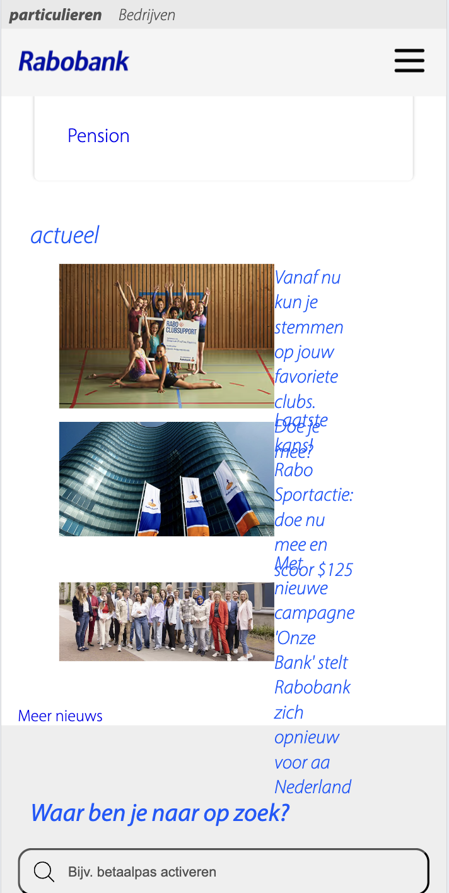

# Procesverslag
Markdown is een simpele manier om HTML te schrijven.  
Markdown cheat cheet: [Hulp bij het schrijven van Markdown](https://github.com/adam-p/markdown-here/wiki/Markdown-Cheatsheet).

Nb. De standaardstructuur en de spartaanse opmaak van de README.md zijn helemaal prima. Het gaat om de inhoud van je procesverslag. Besteedt de tijd voor pracht en praal aan je website.

Nb. Door *open* toe te voegen aan een *details* element kun je deze standaard open zetten. Fijn om dat steeds voor de relevante stuk(ken) te doen.

## Jij

  
uitwerken voor kick-off werkgroep

  ### Auteur:
  Jasper Brug

  #### Je startniveau:
  Blauw

  #### Je focus:

 Responsive

## Je website

  
uitwerken voor kick-off werkgroep

  ### Je opdracht:
  https://www.rabobank.nl/particulieren

  #### Screenshot(s) van de eerste pagina (small screen): 
  homepage 
  

  #### Screenshot(s) van de tweede pagina (small screen):
  hier de naam van de pagina  
  
 

## Toegankelijkheidstest 1/2 (week 1)

  
uitwerken na test in 2e werkgroep

  ### Bevindingen
  Lijst met je bevindingen die in de test naar voren kwamen:
1.	Pagina’s van hamburgermenu’s werken niet als je er overheen hovert.
2.	De screenreader legt heel genuanceerd uit wat de knop doet als je erop klikt en wat je kan doen als je weg wilt (soms te genuanceerd). 
3.	De screenreader praat relatief snel. 
4.	De screenreader vertelt niet op welke je pagina zit. Hij zegt dat je je op een groep bevind in webmateriaal. 
5. De screenreader vertelt ook niet vaak wat voor element het is. 

## Breakdownschets (week 1)

  
uitwerken na afloop 3e werkgroep

  ### de hele pagina: 
  

  

  ### dynamisch deel (bijv menu): 
  

  ### wellicht nog een dynamisch deel (bijv filter): 
  

## Voortgang 1 (week 2)

  
uitwerken voor 1e voortgang

  ### Stand van zaken
  Ik had bij het eerste voortgangsgesprek alleen nog maar mijn html af. Hierdoor had ik nog niet zoveel vragen over
  de opdracht. Ik kreeg wel al een paar goede tips. Bijvoorbeeld dat het handig is om met properties te werken.

  ### Agenda voor meeting
  samen met je groepje opstellen

  | student 1      | student 2          | student 3    | student 4        |
  | ---            | ---                | ---          | ---              |
  | dit bespreken  | en dit             | en ik dit    | en dan ik dat    |
  | en dat ook nog | dit als er tijd is | nog een punt | dit wil ik zeker |
  | ...            | ...                | ...          | ...              |
bespreken: hiërarchie html.
nog doen: beginnetje maken aan css.

  ### Verslag van meeting
  hier na afloop snel de uitkomsten van de meeting vastleggen

  - De html pagina was over het algemeen prima. Wel nog even goed kijken of alles semantisch is.
  - Werk met properties.
  - Tempo ietsjes opvoeren. 
  - ...

## Voortgang 2 (week 3)

  
uitwerken voor 2e voortgang

  ### Stand van zaken
  Ik was al best ver met de vormgeving, alleen zag alles er alleen goed uit op de telefoon. oftewel niks was nog responsive.  Dus hier had ik nog wel wat vragen over.

  ### Agenda voor meeting
  samen met je groepje opstellen

  | student 1      | student 2          | student 3    | student 4        |
  | ---            | ---                | ---          | ---              |
  | dit bespreken  | en dit             | en ik dit    | en dan ik dat    |
  | en dat ook nog | dit als er tijd is | nog een punt | dit wil ik zeker |
  | ...            | ...                | ...          | ...              |

  ### Verslag van meeting
  hier na afloop snel de uitkomsten van de meeting vastleggen

  - Werk met 'grid' en 'flexbox'. Kijk vooral ook nog terug naar de lesopdrachten.
  - Werk met media queries, zodat je de vormgeving kan aanpassen als het scherm veranderd van grootte. Op DLO
  staat hier nog een uitleg video van. 
  - Kortom ik kreeg vooral de tips om terug te kijken naar de lesopdrachten.
- ...

## Toegankelijkheidstest 2/2 (week 4)

  
uitwerken na test in 9e werkgroep

  ### Bevindingen
  Lijst met je bevindingen die in de test naar voren kwamen (geef ook aan wat er verbeterd is):

  1. Doordat ik zowat alle elementen ook heb aangegeven als die elementen, kan de screenreader
  goed duidelijk maken wat er staat. 
  2. de HTML was nog niet helemaal gevalideert. 
  3. De content is nu wel bijna op alle schermen te goed te lezen en te begrijpen.
  4. alle plaatjes hebben een 'alt' tekstje, waardoor de screenreader dat goed kon uitleggen.
  

## Voortgang 3 (week 4)

  
uitwerken voor 3e voortgang

  ### Stand van zaken
  Voor mijn gevoel liep ik nog best achter. Ik had dan ook best wel veel vragen.

  ### Agenda voor meeting
  samen met je groepje opstellen

  | student 1      | student 2          | student 3    | student 4        |
  | ---            | ---                | ---          | ---              |
  | dit bespreken  | en dit             | en ik dit    | en dan ik dat    |
  | en dat ook nog | dit als er tijd is | nog een punt | dit wil ik zeker |
  | ...            | ...                | ...          | ...              |

  ### Verslag van meeting
  hier na afloop snel de uitkomsten van de meeting vastleggen

  - korte uitleg over hoe ik grid makkelijk kan toepassen voor het positioneren van de content. Dit was echt wat ik nodig had om de website af te maken. 
  - micro-interactie check. 
  - 
  - ...

## Eindgesprek (week 5)

  
uitwerken voor eindgesprek

  ### Je uitkomst - karakteristiek screenshots:
  Ik heb twee pagina's van de Rabobank website nagemaakt. De homepagina en de pagina over hypotheken. Ik heb deze pagina's zoveel mogelijk responsive proberen te maken, om zo eigenlijk te website beter te maken. Over het algemeen 
  ben ik best tevreden over wat ik heb neergezet. Aan het begin van deze opdracht was ik eigenlijk nog helemaal blanco 
  qua kennis van html, css en javascript. Ik had natuurlijk vorig jaar al het een ander gedaan, maar dat waren eigenlijk allemaal best kleine opdrachtjes vergeleken met dit project. Verder vond ik het wel een moeilijke opdracht. Ik merkte echt dat ik veel vragen moest stellen om verder te komen, want in mijn eentje kwam ik er meestal niet uit. Hierdoor heb ik ook niet alles af kunnen krijgen als hoe ik het wilde hebben. Al met al vond ik het wel een leuk leertraject, en ben ik benieuwd wanneer ik deze nieuwe kennis en vaardigheden weer mag inzetten.

  ### Dit ging goed/Heb ik geleerd: 
  Een van de de dingen die echt belangrijk waren om mijn website responsive te maken, was toch wel het gebruik maken van 'grid'. Ik had vorig jaar eigenlijk alleen nog maar met flexbox gewerkt, en zag er eigenlijk best wel tegenop om grid te gebruiken. Maar ik kwam er uiteindelijk achter dat Grid harstikke handig is als je wil dat je content op elk soort scherm er goed en duidelijk uit ziet. 

  
  
  

  Verder had ik ook geleerd dat je inplaats van het handmatig opschrijven van de grid columnen en rows, dit ook kan aanroepen met een kortere regel die eigenlijk ook beter werkt.

  grid-template-columns: repeat(auto-fit, minmax(300px,1fr));

  Door deze regel schaalt het grid automatisch op basis van hoe groot het element is op de voledige breedte. Hierdoor hoefte je zelf ook niet veel na te denken en zag het er ook professioneel uit. 

  Als laatste waren de media queries ook een gamechanger voor mij. Aan het begin van dit project wist ik nog niet wat het was, omdat ik er nog niet eerder mee had gewerkt. Maar dit was echt top voor het aanpassen van de vormgeving als het scherm van grootte veranderd. 

  

  ### Dit was lastig/Is niet gelukt:
  Helaas waren er ook een aantal dingen die ik lastig vond of die niet gelukt zijn. 
  Om te beginnen de grootste fout van de pagina's. 

  Dit is bij het stukje 'actueel' van de homepage, en het gaat om die drie collage afbeeldingen met tekst. Als eerste kreeg ik het niet voor mekaar om ze mooi mee te schalen met de grootte van het scherm. En als tweede wilde ik dat als je op mobiel formaat kijkt, dat de afbeeldingen kleiner worden en onder elkaar gaan staan met aan de rechter kant tekst. Maar vooral dat laaste lukte niet. Ik heb tot het laaste moment nog ermee gepuzzeld, maar elke verandering die ik maakte, maakte het nog lelijker en onduidelijker. Dus hier heb ik helaas mijn verlies moet pakken.
  
   

  Nog een ding wat niet ik niet snapte en dus ook niet goed ging, waren de list-items van de socialmedia icons. Ze waren namelijk onnodig lang in de hoogte waardoor ze veel ruimte in beslag namen.
  

  Een ander ding wat ik ook niet snapte, was het gebruik maken van 'position: fixed'. Er was namelijk een icon waarvan ik dat wilde hebben. Alleen als ik die regel toepaste verdween die gewoon. De docent had hier nog wat over gezegd, alleen dat was ik vergeten helaas.
  

  Als laaste waren er nog een aantal kleine dingen waar ik helaas niet aan toe gekomen ben om het op te lossen.
  Ik had namelijk nog meer willen werken met hover en focus functies, om de website nog gebruikersvriendelijker te maken en dus meer 'responsive'. Ook zien een aantal dingen er niet helemaal netjes uit op de pagina, dus daar had ik eigenlijk ook nog wat meer mee willen klooien. Over het algemeen vind ik toch dat ik vaak iets te laks ben geweest. Ik dacht vaak dat ik veel dingen zelf wel kon oplossen, waardoor ik heel lang bezig was met een klein ding. Hierdoor heb ik best wel tijd verloren. Kortom, voor de volgende keer zal ik meer vragen stellen en realistisch blijven nadenken over of ik iets wel of niet kan.  

  

## Bronnenlijst

  
continu bijhouden terwijl je werkt

  Ik heb uiteindelijk niet veel bronnen gebruikt. Bij de meeste dingen kreeg ik hulp van de studenten-assistenten of de docent. En anders vroeg ik het chat-gpt.

  Nb. Wees specifiek ('css-tricks' als bron is bijv. niet specifiek genoeg). 
  Nb. ChatGpT en andere AI horen er ook bij.
  Nb. Vermeld de bronnen ook in je code.

  1. https://www.youtube.com/watch?v=EiNiSFIPIQE&ab_channel=SlayingTheDragon
    (uitleg filmpje over grid)
  2. https://chatgpt.com/share/66f57d66-2e58-8001-bb33-4f38bc98be46
    (chat-gpt chat)
  3. ...

